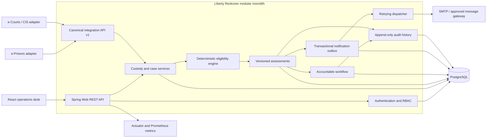
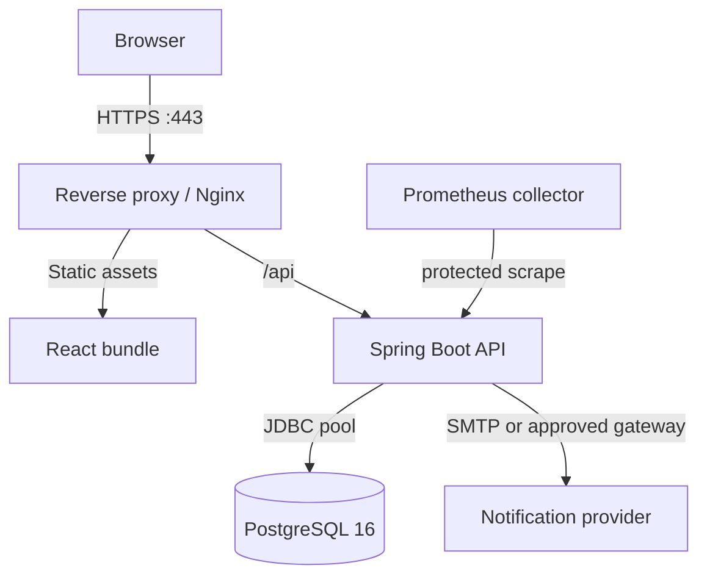
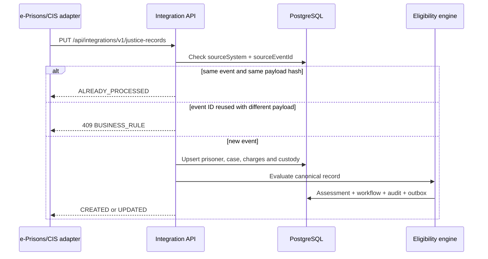
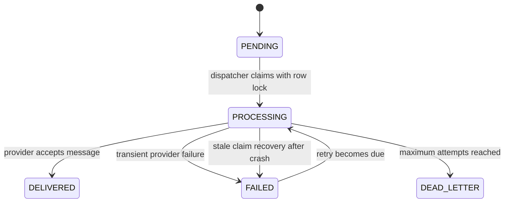
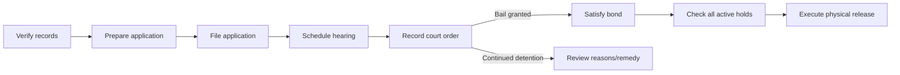
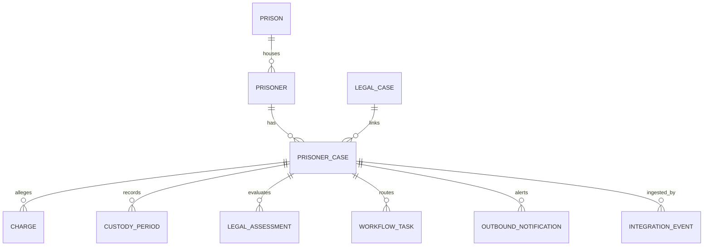

# Liberty Reckoner

**An explainable custody-rights and statutory-release assurance platform.**

Liberty Reckoner helps prison authorities, District Legal Services Authorities (DLSAs), court registries and oversight teams identify undertrial prisoners who require action under Section 479 of the Bharatiya Nagarik Suraksha Sanhita, 2023 (BNSS). It converts verified custody and case data into a reproducible legal calculation, opens an accountable multi-agency workflow, prepares a source-backed application draft and records whether the person was physically released.

> Liberty Reckoner is decision-support software. It does not grant bail, replace a court, predict guilt, assess dangerousness or invent missing legal facts.

## Contents

1. [The problem](#the-problem)
2. [The statutory model](#the-statutory-model)
3. [How Liberty Reckoner solves it](#how-liberty-reckoner-solves-it)
4. [Architecture assessment](#architecture-assessment)
5. [System architecture](#system-architecture)
6. [Core runtime flows](#core-runtime-flows)
7. [Eligibility engine](#eligibility-engine)
8. [Data architecture](#data-architecture)
9. [Backend architecture](#backend-architecture)
10. [Frontend architecture](#frontend-architecture)
11. [Security and privacy](#security-and-privacy)
12. [Reliability and observability](#reliability-and-observability)
13. [API and integration model](#api-and-integration-model)
14. [Run locally](#run-locally)
15. [Testing](#testing)
16. [Production deployment](#production-deployment)
17. [Scaling strategy](#scaling-strategy)
18. [Design decisions and trade-offs](#design-decisions-and-trade-offs)

## The problem

The operational problem is not merely “calculate half of a sentence”. A correct custody-rights system must reconcile data and responsibility across institutions.

- Prison records contain custody periods, transfers, temporary release periods and verification states.
- A person may have several charges in one case, or several active cases.
- The maximum statutory sentence can change with the applicable law and effective date.
- Delay attributable to the accused may need to be excluded from credited detention.
- First-time-offender status changes the applicable threshold.
- Death or life-imprisonment possibilities affect whether Section 479 applies.
- Crossing a threshold does not itself create a court order or prove that physical release occurred.
- An alert without an owner, deadline and escalation path can still be ignored.
- A release order may not result in liberty if bond requirements or another active hold remains.

The result is a socio-technical failure: relevant facts exist, but they are fragmented; calculations are manual; accountability changes hands; and the prisoner least able to navigate the system bears the cost of delay.

## The statutory model

The engine models the following Section 479 concepts:

- the ordinary one-half threshold;
- the one-third threshold for a verified first-time offender;
- exclusion where death or life imprisonment is specified as a possible punishment;
- exclusion of verified delay attributable to the accused;
- a maximum-imprisonment safeguard;
- explicit legal review where multiple offences or active cases are pending;
- the jail superintendent’s duty to apply to the court when the applicable threshold is completed.

The authoritative source is [India Code — BNSS Section 479](https://www.indiacode.nic.in/show-data?abv=CEN&actid=AC_CEN_5_23_00049_202346_1719552320687&orderno=479&orgactid=AC_CEN_5_23_00049_202346_1719552320687&sectionId=91464&sectionno=479&statehandle=123456789%2F1362). Rules and sentence catalogues must still be approved and maintained by the competent legal authority before real-world use.

### Why the original “50% calculator” is insufficient

A simplistic implementation would calculate `days in prison / maximum sentence`. That would be unsafe because it might double-count overlapping periods, accept unverified conviction history, ignore multiple active cases, use the wrong maximum term or imply release when only a court can order it. Liberty Reckoner returns `DATA_INCOMPLETE` or `LEGAL_REVIEW` instead of manufacturing certainty.

## How Liberty Reckoner solves it

Liberty Reckoner treats the problem as a **release-assurance lifecycle**, not a single calculation.

| Capability | What the system does |
|---|---|
| Canonical ingestion | Accepts idempotent, versioned records from approved e-Prisons, CIS or ICJS adapters. |
| Verification-aware calculation | Uses only legally relevant, verified custody and delay inputs. |
| Explainable decision | Persists the threshold, credited days, exclusions, blockers, rule version and explanation. |
| Early warning | Creates a verification task before the projected threshold date. |
| Statutory action | Creates owned tasks when action is due or overdue. |
| Durable alerts | Writes alerts to a transactional outbox and delivers them independently with retry. |
| Application assistance | Generates a source-backed Section 479 application draft for review and signature. |
| End-to-end workflow | Tracks preparation, filing, hearing, order, bond and physical release. |
| Oversight | Exposes occupancy, urgent cases, overdue hand-offs and notification delivery state. |
| Auditability | Records who performed a legal or workflow action, when, and against which aggregate. |

## Architecture assessment

### Was the original project SDE-1 level?

Yes. The first implementation was a **strong SDE-1/full-stack portfolio architecture**: layered Spring Boot code, PostgreSQL migrations, deterministic domain logic, pagination, RBAC, CSRF protection, idempotent integration, React routing and Docker Compose. It went beyond a CRUD tutorial.

It was not yet a complete production architecture. The upgraded version addresses the most important gaps without prematurely splitting the system into microservices.

| Area | Earlier state | Upgraded state |
|---|---|---|
| Notifications | Workflow creation only | Transactional outbox, SMTP port, retry, stale-claim recovery and dead-letter state |
| Concurrency | Last writer could win | Pessimistic evaluation lock and optimistic versions on mutable workflow aggregates |
| Scheduling | One large transaction | Per-case transactions with independent error isolation |
| Production safety | Checklist only | Fail-fast checks for demo data, insecure cookies, local secret, localhost CORS and log-only alerts |
| Observability | Health endpoint | Prometheus metrics, request IDs, structured failure logs and health probes |
| Backend tests | Rule-engine unit tests | Rule tests, outbox tests and PostgreSQL/Testcontainers migration test |
| Frontend tests | Production build only | Vitest, Testing Library and deterministic component/utility tests |
| Operations UI | Cases and tasks | Dedicated notification-delivery ledger for administrators and auditors |

This is now a **production-oriented modular monolith** suitable for an SDE-1 candidate to discuss at an advanced level and for a team to evolve through legal validation, security review and government integration testing.

## System architecture



### Why a modular monolith?

The legal assessment, current case state, workflow creation, audit event and outbox insertion require strong transactional consistency. Keeping them in one deployable Spring Boot application makes those invariants easier to reason about and test. The code still exposes clear seams—repositories, services, the pure rule engine and notification delivery port—so a high-volume capability can be extracted later without rewriting the domain.

Microservices would add network failure, distributed transactions, additional authentication and operational overhead before the workload justifies them. The outbox pattern supplies the most valuable asynchronous boundary while retaining database consistency.

### Deployment topology



Only the frontend port is published by the demonstration Compose stack. The API and database stay on the private application network.

## Core runtime flows

### 1. Justice-record ingestion



The source event key and SHA-256 payload hash prevent accidental duplicate processing and detect inconsistent replay.

### 2. Eligibility evaluation

1. Lock the `prisoner_case` aggregate for evaluation.
2. Load charges, custody periods, conviction verification and active-case count.
3. Reject unsupported or unverified inputs into an explicit review state.
4. Merge overlapping verified custody intervals.
5. Subtract only verified accused-attributable delay.
6. Resolve the controlling finite maximum sentence.
7. Apply one-third or one-half threshold rules.
8. Apply exclusions and the maximum-period safeguard.
9. Mark the old assessment historical and save the new assessment with a rule version.
10. Create a workflow task if no open task already exists.
11. If a new statutory alert state was entered, insert three outbox records in the same transaction.
12. Append an audit event and increment a status-labelled metric.

If any database action fails, the assessment, workflow, audit and alerts roll back together.

### 3. Durable alert delivery



The dispatcher claims a bounded batch in a short transaction, sends messages outside that transaction, then marks each result in a separate transaction. Exponential back-off limits retry pressure. A unique event key prevents duplicate institutional alerts for the same assessment and role.

The default `log` transport is for demonstrations. The `prod` profile refuses to start with that transport; configure `smtp` or implement another approved adapter behind `NotificationDeliveryPort`. When SMTP is active, set `LIBERTY_RECKONER_MAIL_HEALTH_ENABLED=true` so the health endpoint verifies the mail server. It defaults to `false` because log-mode operation deliberately has no SMTP dependency.

### 4. Accountable release workflow



Completing a calculation is deliberately different from recording a court order, and recording bail is deliberately different from confirming physical release.

## Eligibility engine

The core engine is a pure Java component. It accepts an immutable `EligibilityInput`, a calculation date and no database or web dependencies. It returns an immutable `EligibilityDecision`.

### Output states

| Status | Meaning |
|---|---|
| `DATA_INCOMPLETE` | A required fact is missing or unverified. |
| `NOT_DUE` | Credited custody is below the advance-warning window. |
| `DUE_SOON` | Threshold is approaching; records should be verified now. |
| `ACTION_OVERDUE` | The applicable threshold is crossed and action is outstanding. |
| `MAXIMUM_REACHED` | Credited detention reached the finite maximum term safeguard. |
| `LEGAL_REVIEW` | Multiple active cases/offences or another restriction requires legal review. |
| `SECTION_479_INAPPLICABLE` | Death/life punishment exclusion is present; alternate bail grounds still require review. |
| `APPLICATION_FILED` | The workflow records that an application was filed. |
| `BAIL_GRANTED` | A court outcome granting bail was recorded. |
| `RELEASED` | Physical release was verified and recorded. |

### Important calculation properties

- Date intervals are inclusive.
- Overlapping or adjacent custody periods are merged before counting.
- Unverified custody does not silently contribute to a positive result.
- The threshold uses ceiling division so a fractional day never causes early eligibility.
- A first-time threshold is used only when conviction history is verified and contains no prior conviction.
- The rule version is stored with every assessment so a future legal-rule update does not rewrite history.
- The maximum-term safeguard is evaluated independently of the normal threshold.

## Data architecture

### Main aggregates and relationships



### Persistence rules

- Flyway owns the schema; Hibernate runs with `ddl-auto=validate`.
- UUIDs avoid coordination across future regional writers.
- Foreign keys and check constraints protect structural integrity.
- `legal_assessment.is_current` keeps one operational result while preserving history.
- `workflow_task.version` and `prisoner_case.version` implement optimistic concurrency control.
- Evaluation obtains a pessimistic lock to prevent two current assessments being created concurrently.
- Search, current-status, deadline, integration-idempotency and outbox-dispatch paths are indexed.
- Audit rows are append-only at the application layer.

## Backend architecture

The backend uses Java 21 and Spring Boot.

```text
in.gov.libertyreckoner
├── api/             REST controllers, validation DTOs and error contract
├── config/          Security, seeding, request IDs and production safety
├── domain/          JPA entities and domain enums
├── notification/    Outbound delivery port, SMTP/log adapters and dispatcher
├── repository/      Spring Data JPA persistence boundaries
├── security/        JWT creation, cookie authentication and user lookup
└── service/         Use cases, transaction boundaries, rules and mappings
    └── eligibility/ Pure deterministic legal-calculation model
```

### Layer responsibilities

- **Controllers** translate HTTP to use-case calls. They do not implement legal rules.
- **DTOs** form the public JSON contract and carry validation annotations.
- **Services** own transactions, workflow invariants and orchestration.
- **Eligibility engine** owns calculation rules without knowing about HTTP or persistence.
- **Repositories** express storage queries and locking requirements.
- **Delivery port** applies hexagonal architecture to external messaging.
- **Global exception handler** returns stable error codes and request IDs without exposing stack traces.

### Transaction boundaries

`EligibilityService.evaluate` is the central consistency boundary. The daily scheduler calls it through a separate Spring bean so every case has its own transaction. One corrupt record is logged and measured but cannot roll back all other cases.

Workflow mutations are also transactional. A conflicting edit produces HTTP `409 CONCURRENT_UPDATE`, prompting the caller to refresh instead of overwriting another official’s work.

## Frontend architecture

The frontend is React 18 with functional components, hooks, React Router, Axios, Bootstrap 5 and a custom responsive design system.

```text
src/
├── api/          Configured Axios client and stable error extraction
├── components/   Reusable layout, status, metrics, loading and document UI
├── pages/        Route-level use cases
├── state/        Authentication and toast contexts
├── styles/       Product-specific visual system and responsive behaviour
├── test/         Shared Vitest/DOM setup
└── utils/        Presentation-safe date, status and identity formatting
```

### State strategy

Server records remain authoritative. Route pages own short-lived query and form state; authentication and toast notifications are the only cross-cutting contexts. The application intentionally avoids a global client cache because its present read/write volume does not justify that complexity. Axios carries the HTTP-only session cookie and mirrors the CSRF cookie into the required header.

### UX principles

- show the action, owner and deadline—not merely a colour;
- keep legal explanations beside the calculated numbers;
- distinguish missing data from statutory inapplicability;
- preserve keyboard focus, responsive layouts and reduced-motion preferences;
- make the court application print-ready but visibly a draft;
- expose alert delivery to authorised administrators and auditors.

## Security and privacy

### Implemented controls

- BCrypt password hashes with cost factor 12;
- short-lived signed JWT stored in an HTTP-only `SameSite=Strict` cookie;
- CSRF cookie/header protection for state-changing requests;
- role-based endpoint and method authorisation;
- exact-origin credentialed CORS configuration;
- request IDs returned on every API response;
- generic client errors and server-side exception logs;
- Nginx Content Security Policy and security headers;
- non-root backend container;
- private API/database Compose network;
- production startup guardrails;
- no automated legal decision or opaque risk score.

### Roles

| Role | Typical access |
|---|---|
| `ADMIN` | System administration, integrations and alert-delivery operations. |
| `SUPERINTENDENT` | Prison records, preparation, bond checks and physical release. |
| `DLSA_COUNSEL` | Record verification, legal review and bond assistance. |
| `COURT_REGISTRY` | Filing acknowledgement, listing and court-order recording. |
| `AUDITOR` | Read-only oversight, audit evidence and delivery ledger. |

### Required production controls outside this repository

Government identity federation, network allow-lists, managed encryption keys, database encryption, central immutable log export, retention schedules, data-subject correction procedures, VAPT, accessibility audit, approved backups and disaster-recovery exercises remain deployment responsibilities.

See [SECURITY.md](SECURITY.md) for reporting and hardening guidance.

## Reliability and observability

| Concern | Mechanism |
|---|---|
| Process readiness | Spring Actuator health probes and Compose health checks. |
| Request tracing | Accepted/generated `X-Request-Id` propagated in responses and errors. |
| Legal metrics | `libertyreckoner.eligibility.evaluations` labelled by status. |
| Scheduled refresh | Success/failure counter per independently processed case. |
| Notification delivery | Delivered/failed counters plus visible outbox states. |
| Provider outage | Exponential retry followed by dead-letter state. |
| Dispatcher crash | Five-minute stale claim recovery. |
| Duplicate source events | Source event ID plus payload hash. |
| Concurrent officials | Optimistic aggregate versions and HTTP 409 response. |
| Database evolution | Ordered, immutable Flyway migrations. |

Prometheus metrics are available through the protected Actuator endpoint. In production, expose it only to the approved monitoring network or gateway identity.

## API and integration model

The browser API lives below `/api`. The externally integrated canonical write API is explicitly versioned:

```http
PUT /api/integrations/v1/justice-records
```

Important endpoints:

| Method | Endpoint | Purpose |
|---|---|---|
| `POST` | `/api/auth/login` | Create the signed session cookie. |
| `GET` | `/api/auth/csrf` | Issue the CSRF token cookie. |
| `GET` | `/api/dashboard/summary` | Portfolio and operational summary. |
| `GET` | `/api/prisoners` | Paginated custody registry search. |
| `GET` | `/api/prisoners/{id}` | Person, case, assessment and task history. |
| `POST` | `/api/cases/{id}/evaluate` | Recalculate a case from verified inputs. |
| `GET` | `/api/cases/{id}/application-packet` | Generate an application draft. |
| `GET` | `/api/workflows/queue` | Read open role-specific hand-offs. |
| `POST` | `/api/workflows/{id}/start` | Claim an open task. |
| `POST` | `/api/workflows/{id}/complete` | Record outcome and generate the next hand-off. |
| `GET` | `/api/notifications/outbox` | Inspect recent alert delivery; admin/auditor only. |
| `GET` | `/api/rules` | Read the human-facing rule catalogue. |

See [docs/API.md](docs/API.md) for payload examples.

## Run locally

### Requirements

- Docker Desktop with Docker Compose
- 4 GB of free memory recommended for the complete build

### Start everything

```bash
docker compose up --build
```

Open [http://localhost:8088](http://localhost:8088).

Demonstration administrator:

```text
Email:    admin@libertyreckoner.gov.in
Password: Liberty@123
```

Other demonstration users use the same password:

```text
superintendent@libertyreckoner.gov.in
dlsa@libertyreckoner.gov.in
registry@libertyreckoner.gov.in
auditor@libertyreckoner.gov.in
```

The default notification transport writes safe delivery metadata to the backend log and marks the outbox record delivered. It does not send real mail.

### Configuration

Copy `.env.example` to `.env` and replace all production-sensitive values.

| Variable | Purpose |
|---|---|
| `POSTGRES_DB` | PostgreSQL database name. |
| `POSTGRES_USER` | Database user. |
| `POSTGRES_PASSWORD` | Database password. |
| `JWT_SECRET` | Random session-signing secret of at least 32 bytes. |
| `JWT_EXPIRATION_MINUTES` | Session lifetime. |
| `LIBERTY_RECKONER_SECURE_COOKIE` | Must be `true` behind production HTTPS. |
| `LIBERTY_RECKONER_SEED_DEMO_DATA` | Must be `false` outside demonstrations. |
| `LIBERTY_RECKONER_CORS_ALLOWED_ORIGINS` | Exact approved frontend origins. |
| `LIBERTY_RECKONER_NOTIFICATION_TRANSPORT` | `log` for demos or `smtp` for configured email delivery. |
| `LIBERTY_RECKONER_NOTIFICATIONS_ENABLED` | Enables the dispatcher. |
| `LIBERTY_RECKONER_MAIL_HEALTH_ENABLED` | Enables SMTP connectivity in application health; use with the SMTP transport. |
| `SMTP_HOST`, `SMTP_PORT` | SMTP provider endpoint. |
| `SMTP_USERNAME`, `SMTP_PASSWORD` | SMTP credentials where required. |
| `SMTP_AUTH`, `SMTP_STARTTLS` | SMTP security controls. |

### Run services during development

Start PostgreSQL, then:

```bash
cd backend
mvn spring-boot:run
```

In another terminal:

```bash
cd frontend
npm install
npm run dev
```

Vite proxies `/api` to `http://localhost:8080`.

## Testing

### Backend

```bash
cd backend
mvn test
```

The suite includes:

- deterministic one-third and one-half threshold cases;
- overlapping custody-period merging;
- maximum-period safeguard;
- death/life exclusion;
- missing verification and multiple-case review;
- creation of three accountable outbox alerts;
- application startup and Flyway migration validation against PostgreSQL through Testcontainers when Docker is available.

### Frontend

```bash
cd frontend
npm test
npm audit
npm run build
```

Vitest and Testing Library verify status semantics, deadline language, fallback identity and dense/compact component behaviour. The Vite production build validates the complete route graph and bundled assets.

### Complete integration smoke test

```bash
docker compose up --build -d
docker compose ps
```

Then verify login, dashboard, paginated registry, workflow, rule catalogue and delivery ledger through `http://localhost:8088`.

## Production deployment

Use the `prod` Spring profile and supply secrets from an approved secret manager. The application intentionally refuses to start in `prod` when:

- demonstration seeding is enabled;
- secure session cookies are disabled;
- the local JWT secret remains configured;
- localhost remains in CORS origins; or
- the log-only notification transport is selected.

Before real records are processed:

1. Obtain written legal approval for the sentence catalogue and rule version.
2. Connect only approved and mutually authenticated justice-system adapters.
3. Reconcile identity and master-data codes across e-Prisons and CIS.
4. Configure TLS, government SSO, network policy and a secret manager.
5. Configure an approved SMTP/message adapter and operational dead-letter review.
6. Enable encrypted backups, point-in-time recovery and disaster-recovery drills.
7. Export audit and security logs to the approved immutable central store.
8. Complete privacy impact, accessibility, penetration and legal-regression testing.
9. Run in read-only shadow mode and compare results with manually verified files.
10. Establish correction, grievance and human-escalation procedures.

## Scaling strategy

The current design scales vertically and horizontally behind a load balancer because application sessions are stateless and stored in signed cookies. PostgreSQL remains the consistency anchor.

Recommended evolution by measured need:

1. Add read replicas for oversight-heavy dashboard traffic.
2. Move scheduled jobs to a cluster-safe scheduler or leader election when multiple API replicas run.
3. Partition historical assessments, audit events and outbox records by date at high volume.
4. Replace SMTP with a government message gateway adapter without changing domain code.
5. Publish outbox events to a broker if cross-department subscribers require them.
6. Extract notification delivery only when it needs independent scaling or ownership.
7. Introduce a search index only when PostgreSQL text/index performance is measured as insufficient.

Do not split the legal calculation from its authoritative input transaction until the consistency and reconciliation model is explicitly designed.

## Design decisions and trade-offs

### Deterministic rules instead of AI eligibility

Eligibility is a rights-affecting calculation. A versioned deterministic engine is reproducible, testable and explainable. AI could later extract candidate facts from documents, but those facts must be verified before the engine consumes them.

### JWT in HTTP-only cookie

This preserves stateless backend scaling while avoiding JavaScript access to the token. Cookie authentication requires CSRF protection, which is enabled. Government SSO should replace local login in production.

### Transactional outbox instead of sending email inside the legal transaction

Sending SMTP before commit can notify officials about a calculation that later rolls back. Sending after commit without a durable record can lose the alert during a crash. The outbox commits intent with the assessment and retries delivery independently.

### PostgreSQL instead of a document database

The domain has strong relationships, uniqueness rules, audit history, transactional invariants and reporting needs. PostgreSQL provides the appropriate consistency model and indexing options.

### Context and page state instead of Redux

The frontend has limited shared mutable state. Authentication and toast contexts are sufficient; adding a larger store would increase ceremony without improving correctness. A query cache can be introduced if server-state interaction becomes substantially richer.

### What “production-ready” means here

The repository contains production-oriented engineering patterns and safe defaults for a demonstration. Actual legal production requires institutional approval, authoritative data, government identity/network integration, operational staffing and formal assurance. Code alone cannot supply those controls.

## Repository layout

```text
LibertyReckoner/
├── backend/
│   ├── src/main/java/          API, domain, services, security and notifications
│   ├── src/main/resources/     Runtime configuration and Flyway migrations
│   └── src/test/               Rule, outbox and PostgreSQL integration tests
├── frontend/
│   ├── src/                    React pages, components, state, tests and CSS
│   ├── nginx.conf              SPA routing, API proxy and security headers
│   └── package-lock.json       Reproducible dependency graph
├── docs/
│   ├── API.md                  Endpoint and integration examples
│   ├── ARCHITECTURE.md         Additional architecture notes
│   ├── INTERVIEW_QUESTIONS.md  Project interview questions and model answers
│   └── LEGAL_GOVERNANCE.md     Rule governance and human-review boundary
├── docker-compose.yml
├── SECURITY.md
└── .env.example
```

## Further documentation

- [API guide](docs/API.md)
- [Architecture notes](docs/ARCHITECTURE.md)
- [Legal governance](docs/LEGAL_GOVERNANCE.md)
- [Interview questions and model answers](docs/INTERVIEW_QUESTIONS.md)
- [Security policy](SECURITY.md)
